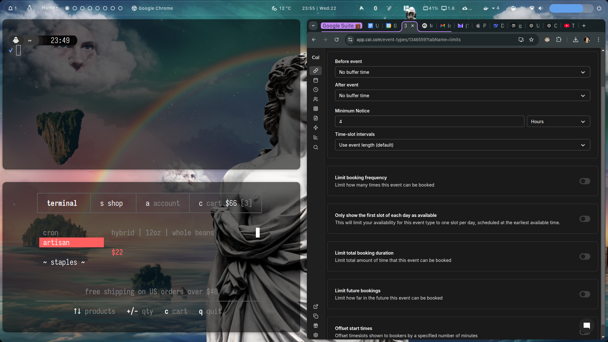
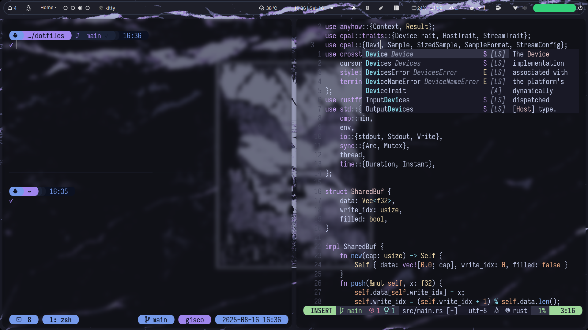
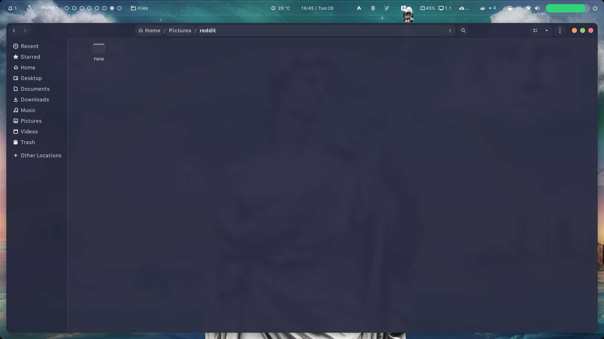

# dotfiles

I run either **Hyprland** or **GNOME**, depending on the machine and workflow. This script is used to replicate my setup 1:1 across all my rigs with one command.

> [!CAUTION]
> The installation script is meant to be used on a minimal Debian (Trixie) installation. It will replace any existing configuration. Proceed with caution.

```shell
bash <(curl -L api.rccyx.com/v1/bootstrap)
```

### Overview (GNOME)

<div style="flex: 1; min-width: 200px; margin: 5px;">
    
</div>

<div style="flex: 1; min-width: 200px; margin: 5px;">
    
</div>

<div style="flex: 1; min-width: 200px; margin: 5px;">
    
</div>
